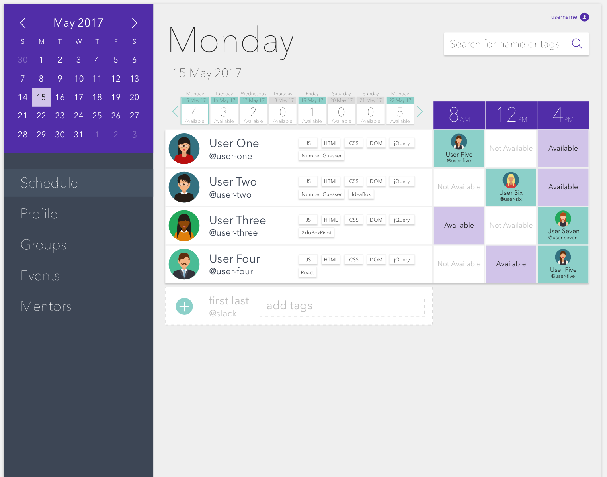
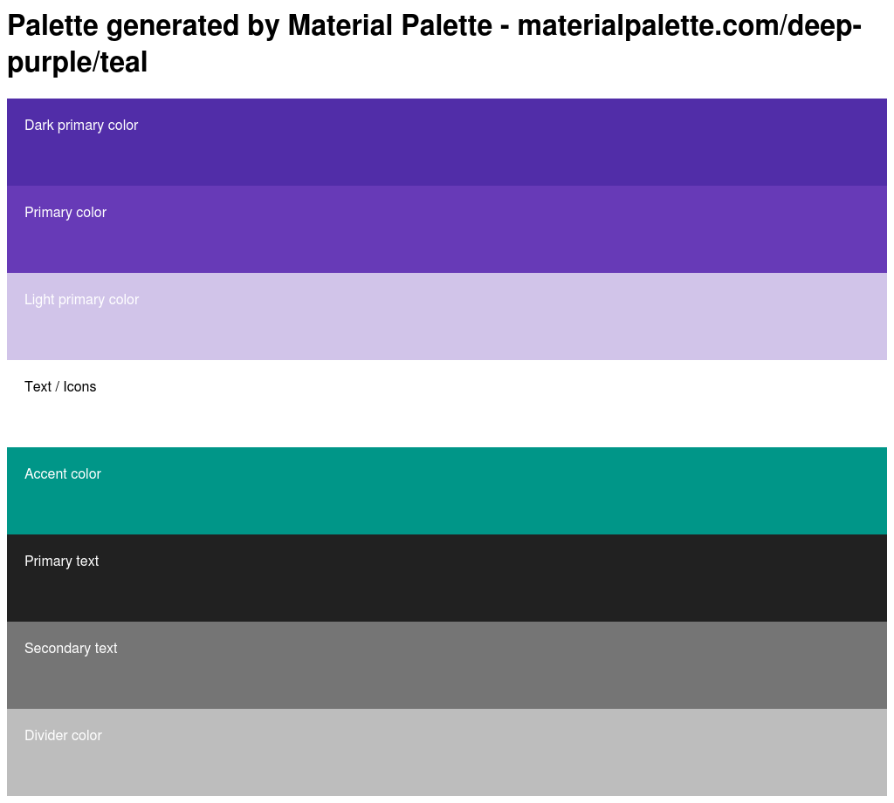

# Pairing is Caring

* Web app that schedules parings between students.

## File Structure

```
project
│   README.md
|   package.json
|───comp
│
└───public
│   │   index.html
|
└───src
    │   index.js
    |   index.css
    |   App.js
    |   App.test.js
    |   App.css
    |   assets
    └───components
```

## Desktop Version



## Palette




## Iterations

### Iteration 0

- [x] Repo
- [x] React project setup
- [x] Desktop Comp
- [ ] Mobile Comp

### Iteration 1

#### front-end

- [ ] React component structure
- [ ] Data model flow chart
- [ ] Component styles
- [ ] Dynamic Calendar
- [ ] Weekly row
- [ ] Main view
- [ ] Aside

#### back-end

- [ ] Data structure
- [ ] restful API

### Iteration 2

#### front-end

- [ ] Data model flow chart
- [ ] Fetch data from API
- [ ] Components with data
- [ ] Add appointment Functionality
- [ ] Add toggle style

#### back-end

- [ ] Profile Information
- [ ] Authentication
- [ ] Manage Posts

### Iteration 3

#### front-end

- [ ] Populate Profiles
- [ ] Testing
- [ ] Search Functionality
